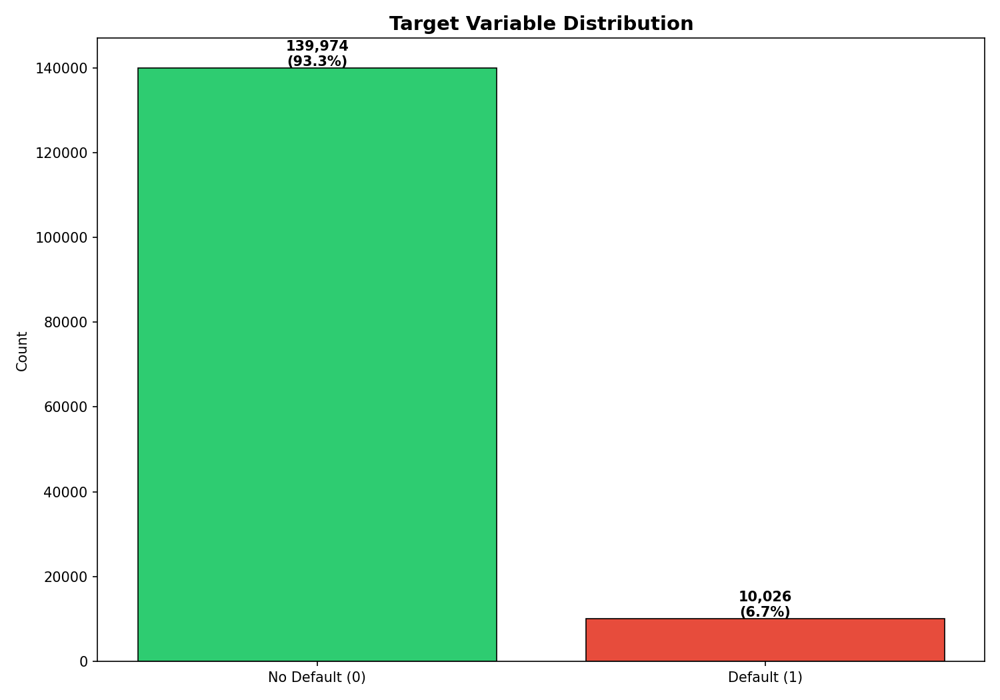

# Credit Risk Classifier

A machine learning project to predict the probability of loan default,
built as a portfolio project for Data Science / Fintech internship applications.

---

## Business Problem

A lending institution needs to decide whether to approve a loan application.
Approving a bad loan costs money (default loss). Rejecting a good loan also
costs money (lost revenue). This project builds a classifier that predicts
the **probability of default**, allowing a bank to set a risk threshold that
balances these two costs, not just maximize accuracy.

---

## Dataset

**Source:** [Give Me Some Credit — Kaggle](https://www.kaggle.com/c/GiveMeSomeCredit/data)  
**Size:** 150,000 borrowers, 11 features  
**Target:** `SeriousDlqin2yrs` — 1 if borrower was 90+ days late on any payment within 2 years

---

## Phases

- [x] Phase 1 — Data Understanding
- [ ] Phase 2 — Exploratory Data Analysis
- [ ] Phase 3 — Preprocessing
- [ ] Phase 4 — Baseline Model (Logistic Regression)
- [ ] Phase 5 — Improved Model (XGBoost)
- [ ] Phase 6 — Evaluation & Threshold Analysis

---

## Key Findings

### Phase 1 — Data Understanding
- Dataset has severe class imbalance: **93.3% non-default, 6.7% default**
- Accuracy is a misleading metric here — a model predicting "never default"
  scores 93.3% while catching zero actual defaulters
- Missing values in `MonthlyIncome` (~20%) and `NumberOfDependents` (~2.6%)
- Outliers detected in `RevolvingUtilizationOfUnsecuredLines`, `DebtRatio`, and `age`

---

## Results

*(populated after modelling)*

---
