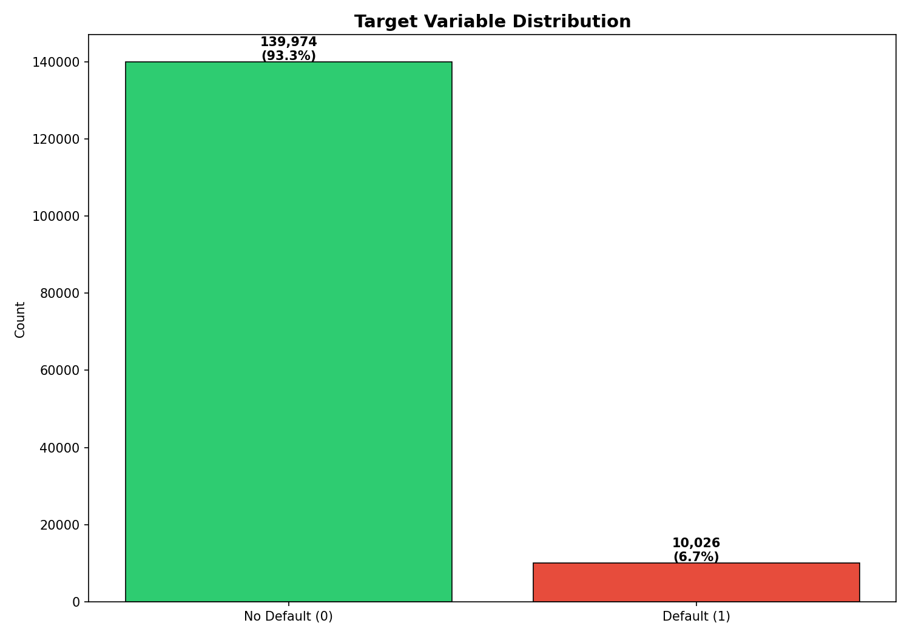
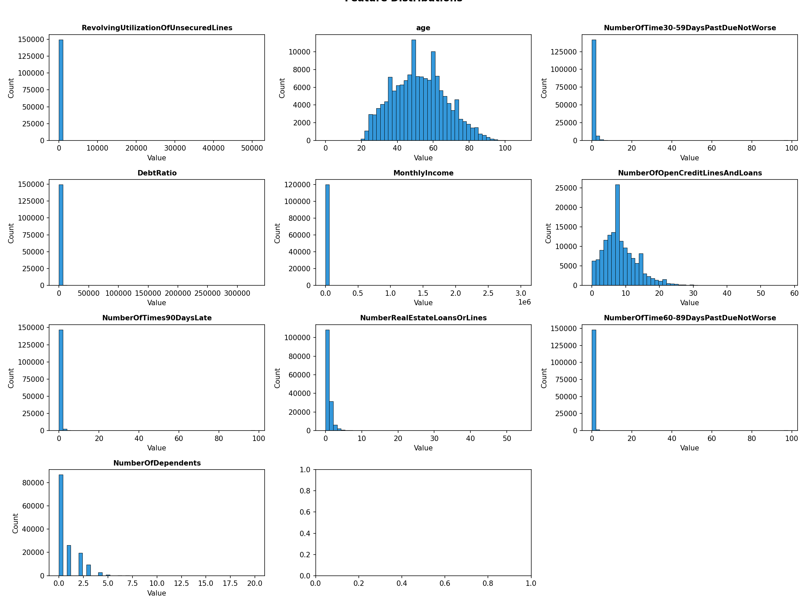
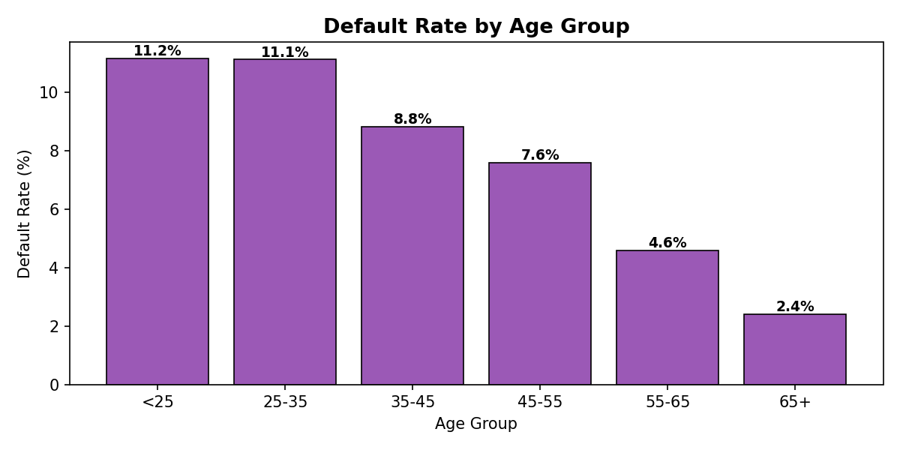
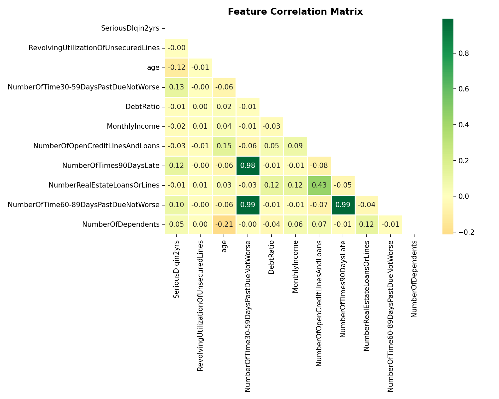
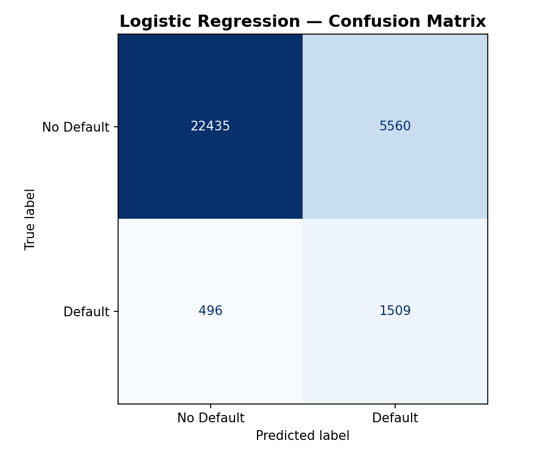
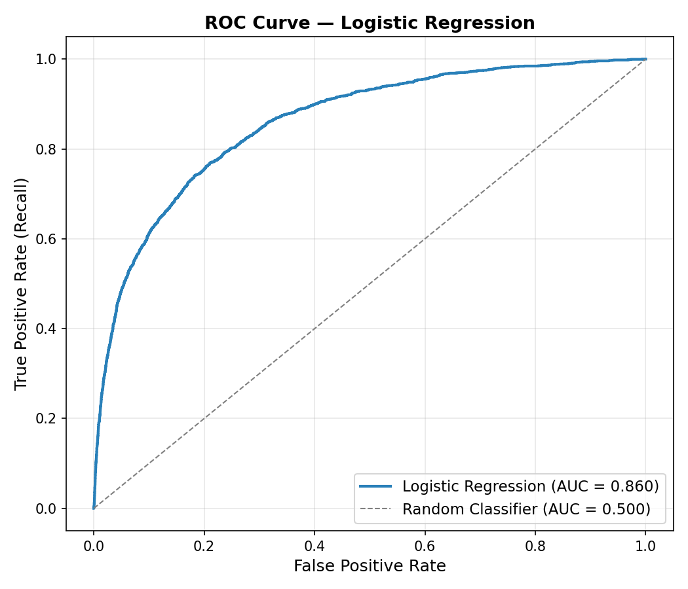
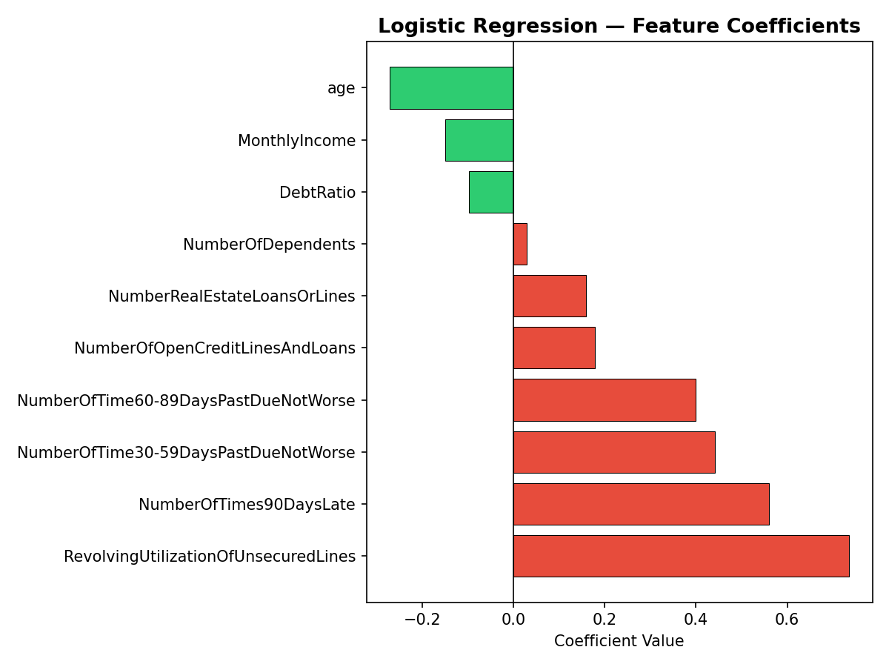
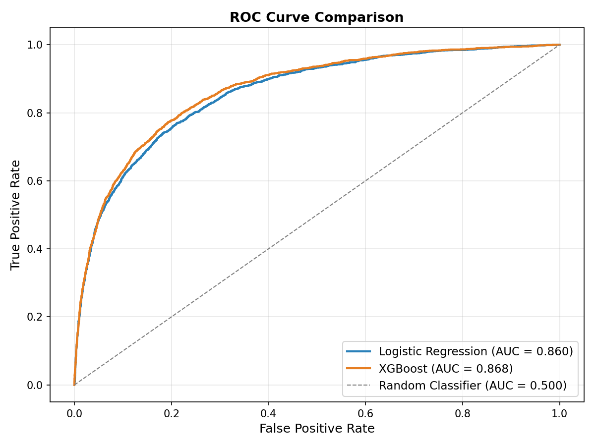
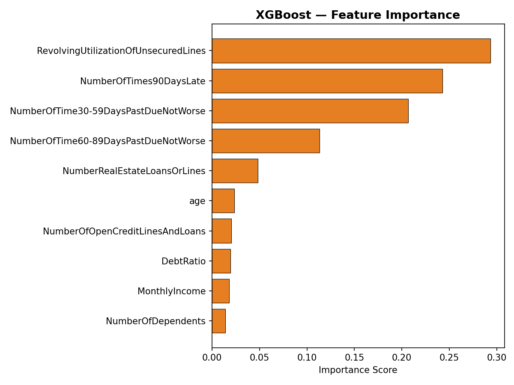

# Credit Risk Classifier

A machine learning project to predict the probability of loan default,
built as a portfolio project for Data Science / Fintech internship applications.

---

## Business Problem

A lending institution needs to decide whether to approve a loan application.
Approving a bad loan costs money (default loss). Rejecting a good loan also
costs money (lost revenue). This project builds a classifier that predicts
the **probability of default**, allowing a bank to set a risk threshold that
balances these two costs, not just maximize accuracy.

---

## Dataset

**Source:** [Give Me Some Credit — Kaggle](https://www.kaggle.com/c/GiveMeSomeCredit/data)  
**Size:** 150,000 borrowers, 11 features  
**Target:** `SeriousDlqin2yrs` — 1 if borrower was 90+ days late on any payment within 2 years

---

## Phases

- [x] Phase 1 — Data Understanding
- [x] Phase 2 — Exploratory Data Analysis
- [x] Phase 3 — Preprocessing
- [x] Phase 4 — Baseline Model (Logistic Regression)
- [x] Phase 5 — Improved Model (XGBoost)
- [ ] Phase 6 — Evaluation & Threshold Analysis

---

## Key Findings

### Phase 1 — Data Understanding
- Dataset has severe class imbalance: **93.3% non-default, 6.7% default**
- Accuracy is a misleading metric here — a model predicting "never default"
  scores 93.3% while catching zero actual defaulters
- Missing values in `MonthlyIncome` (~20%) and `NumberOfDependents` (~2.6%)
- Outliers detected in `RevolvingUtilizationOfUnsecuredLines`, `DebtRatio`, and `age`

### Phase 2 — Exploratory Data Analysis
- Late payment history is the strongest predictor of default — 
  default rate rises sharply with number of late payments
- Younger borrowers (<35) show higher default rates than older age groups
- High credit utilization correlates with default
- Severe outliers confirmed in `RevolvingUtilizationOfUnsecuredLines` 
  and `DebtRatio`  (will be capped during preprocessing)
- Age has at least one invalid value (0) — will be handled in preprocessing

### Phase 3 — Preprocessing
- Capped `RevolvingUtilizationOfUnsecuredLines` at 1.0 (physical maximum for a ratio)
- Capped `DebtRatio` and `MonthlyIncome` at 99th percentile to remove data errors
- Capped late payment columns at 10 (values of 96/98 are coded data errors)
- Replaced invalid age value of 0 with median age
- Imputed missing `MonthlyIncome` (20%) and `NumberOfDependents` (2.6%) with median
- 80/20 train/test split with stratification to preserve class imbalance ratio
- Applied StandardScaler — fit on train only to prevent data leakage

### Phase 4 — Baseline Model (Logistic Regression)

Logistic Regression was chosen as the baseline because it is interpretable,
outputs probabilities directly, and reflects how traditional credit scoring
models are built in practice.

**Model configuration:**
- `class_weight='balanced'` to counter the 93/7 class imbalance
- `max_iter=1000` to ensure convergence
- Features scaled with StandardScaler before training

**The accuracy trap — proven:**

| Model | Accuracy |
|-------|----------|
| Naive model (always predict No Default) | 93.3% |
| Logistic Regression | 80.0% |

The Logistic Regression scores *lower* accuracy than predicting nothing,
yet it catches 75% of actual defaulters while the naive model catches zero.
This is why accuracy is a misleading metric under class imbalance.

**Results:**

| Metric | No Default | Default |
|--------|-----------|---------|
| Precision | 0.98 | 0.21 |
| Recall | 0.80 | 0.75 |
| F1 Score | 0.88 | 0.33 |

| Metric | Score |
|--------|-------|
| AUC-ROC | 0.8596 |

**Interpreting the tradeoff:**

The model operates in a high-recall, low-precision configuration for the
default class, it catches 75% of bad loans but raises false alarms on many
good customers. This reflects the `class_weight='balanced'` pushing the model
toward caution. Whether this tradeoff is acceptable depends on business
strategy. A bank prioritising loss prevention wants high recall; one focused
on customer growth wants higher precision. 
Phase 6 threshold analysis addresses this directly.

---

### Phase 5 — Improved Model (XGBoost)

XGBoost is a gradient boosted tree ensemble that builds 300 decision trees
sequentially, each correcting the errors of the previous ones. Unlike Logistic
Regression it captures non-linear relationships and does not require feature
scaling.

**Model configuration:**
- `n_estimators=300`, `learning_rate=0.05`, `max_depth=5`
- `scale_pos_weight=9` to handle class imbalance (ratio of negatives to positives)
- Trained on unscaled features as tree models do not require scaling

**Model Comparison:**

| Model | AUC-ROC | Precision (Default) | Recall (Default) | F1 (Default) |
|-------|---------|---------------------|------------------|--------------|
| Logistic Regression | 0.8596 | 0.21 | 0.75 | 0.33 |
| XGBoost | 0.8680 | 0.28 | 0.68 | 0.40 |

**Key findings: feature importance**
- `RevolvingUtilizationOfUnsecuredLines` is the single most important feature
  (0.293), despite showing near-zero correlation in the heatmap due to outlier
  distortion. XGBoost recovered the nonlinear signal that correlation missed.
- Late payment columns combined account for 56% of total importance, consistent
  with EDA showing default rate jumping sharply after just one late payment.
- XGBoost trades lower recall (0.68 vs 0.75) for better precision (0.28 vs 0.21)
  compared to Logistic Regression. Threshold analysis in Phase 6 addresses this.

## Results

*(populated after modelling)*

---
